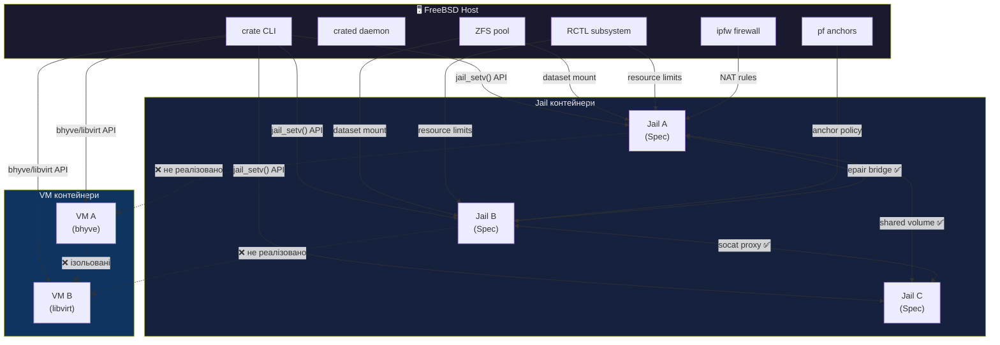
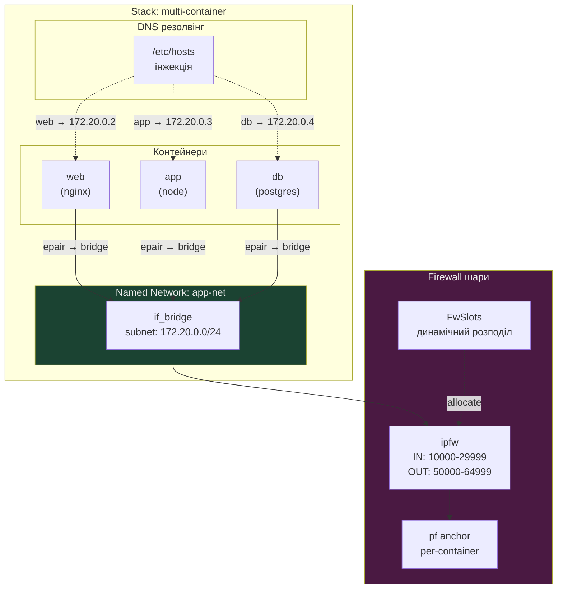
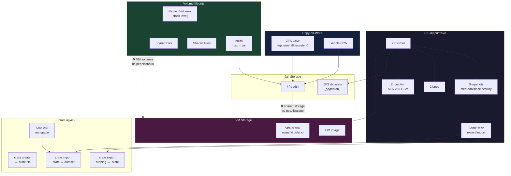
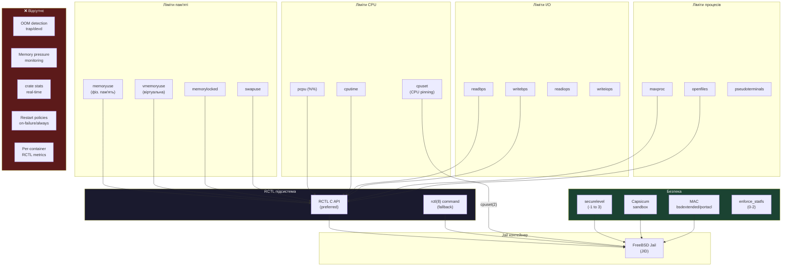
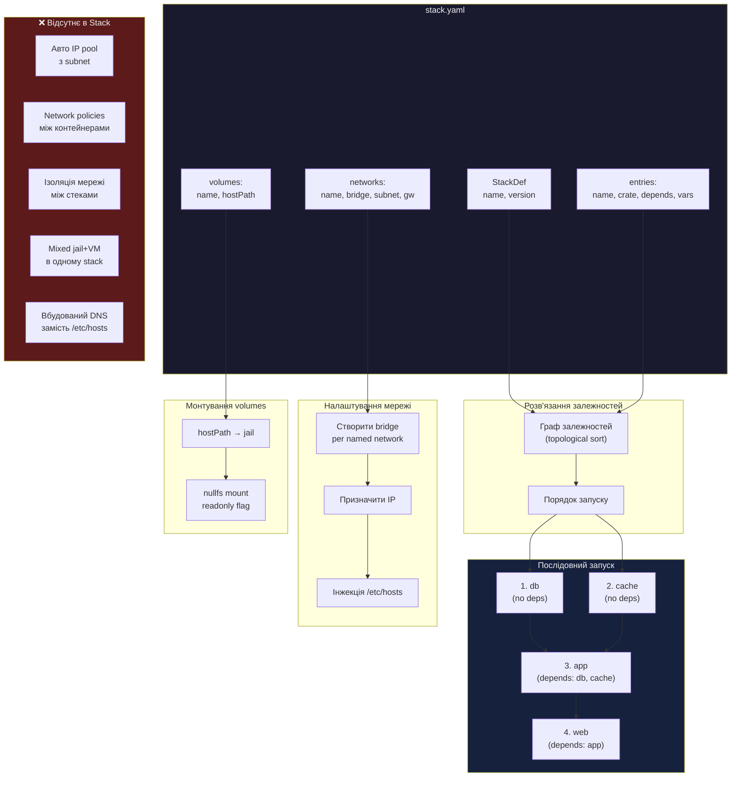
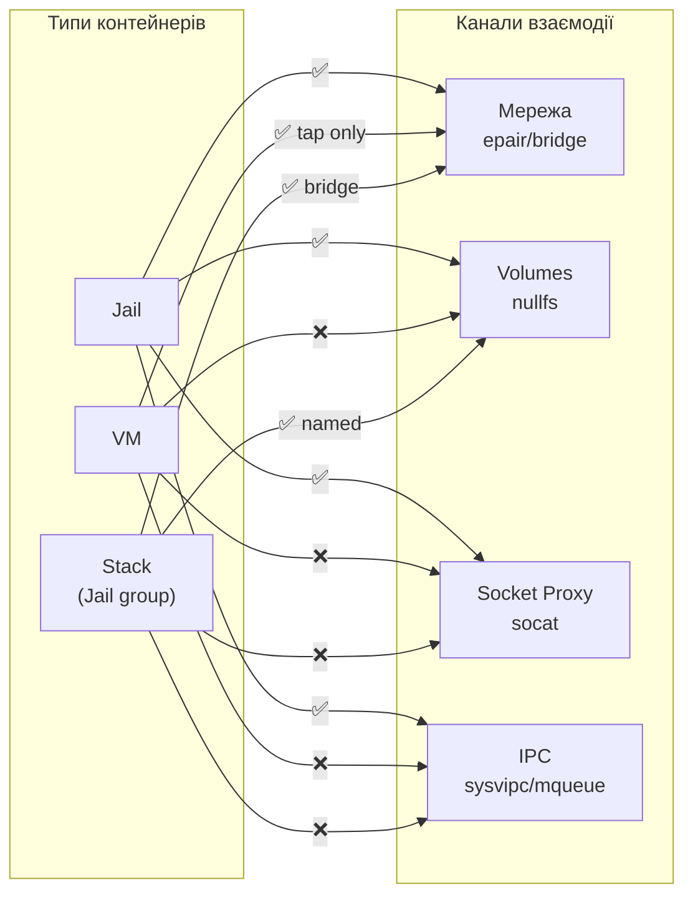

# Діаграми взаємодії контейнерів Crate

## Зміст

1. [Високорівнева взаємодія типів контейнерів](#1-високорівнева-взаємодія-типів-контейнерів)
2. [Мережева архітектура](#2-мережева-архітектура)
3. [Керування диском та сховищем](#3-керування-диском-та-сховищем)
4. [Керування пам'яттю та ресурсами](#4-керування-памяттю-та-ресурсами)
5. [Оркестрація Stack](#5-оркестрація-stack)

---

## 1. Високорівнева взаємодія типів контейнерів

### Легенда

| Зв'язок | Статус | Опис |
|---------|--------|------|
| Jail ↔ Jail | ✅ Реалізовано | epair bridge, shared volumes (nullfs), socat proxy |
| Host → Jail | ✅ Реалізовано | jail_setv(), ZFS dataset, RCTL, ipfw/pf |
| Host → VM | ✅ Реалізовано | bhyve/libvirt API |
| Jail ↔ VM | ❌ Відсутнє | Повна ізоляція, немає спільного bridge |
| VM ↔ VM | ❌ Відсутнє | Ізольовані, немає крос-комунікації |

---

## 2. Мережева архітектура

### 2.1 Чотири мережеві режими

```mermaid
graph LR
    subgraph NAT_MODE["Режим NAT (default)"]
        direction TB
        NAT_J["Jail"]
        NAT_EPAIR_B["epairNb<br/>10.0.0.x"]
        NAT_EPAIR_A["epairNa<br/>10.0.0.1"]
        NAT_IPFW["ipfw NAT"]
        NAT_WAN["WAN iface"]

        NAT_J --- NAT_EPAIR_B
        NAT_EPAIR_B --- NAT_EPAIR_A
        NAT_EPAIR_A --- NAT_IPFW
        NAT_IPFW --- NAT_WAN
    end

    subgraph BRIDGE_MODE["Режим Bridge"]
        direction TB
        BR_J["Jail"]
        BR_EPAIR_B["epairNb"]
        BR_EPAIR_A["epairNa"]
        BR_BRIDGE["if_bridge"]
        BR_PHYS["Фіз. iface"]

        BR_J --- BR_EPAIR_B
        BR_EPAIR_B --- BR_EPAIR_A
        BR_EPAIR_A --- BR_BRIDGE
        BR_BRIDGE --- BR_PHYS
    end

    subgraph PASSTHROUGH_MODE["Режим Passthrough"]
        direction TB
        PT_J["Jail"]
        PT_NIC["Фіз. NIC<br/>(виділений)"]

        PT_J --- PT_NIC
    end

    subgraph NETGRAPH_MODE["Режим Netgraph"]
        direction TB
        NG_J["Jail"]
        NG_EIFACE["ng eiface"]
        NG_BRIDGE["ng_bridge"]
        NG_PHYS["Фіз. iface"]

        NG_J --- NG_EIFACE
        NG_EIFACE --- NG_BRIDGE
        NG_BRIDGE --- NG_PHYS
    end
```

### 2.2 Мережева взаємодія в Stack

### 2.3 Мережа — що реалізовано і що відсутнє

| Функція | Статус | Деталі |
|---------|--------|--------|
| NAT через epair + ipfw | ✅ | `run_net.cpp::createEpair()` |
| Bridge (if_bridge) | ✅ | `run_net.cpp::createBridgeEpair()` |
| Passthrough (фіз. NIC) | ✅ | `run_net.cpp::passthroughInterface()` |
| Netgraph (ng_bridge) | ✅ | `run_net.cpp::createNetgraphInterface()` |
| IPv6 (NAT ULA, SLAAC, static) | ✅ | Повна підтримка |
| VLAN 802.1Q | ✅ | ID 1-4094 |
| Статичний MAC (SHA-256) | ✅ | `run_net.cpp::generateStaticMac()` |
| Port forwarding (TCP/UDP) | ✅ | ipfw redirect rules |
| pf anchor per-container | ✅ | `run_net.cpp::setupPfAnchor()` |
| Stack bridge creation | ✅ | `stack.cpp` bridge setup |
| /etc/hosts DNS інжекція | ✅ | `stack.cpp` hosts generation |
| **Вбудований DNS-сервіс для стеків** | ❌ | Тільки /etc/hosts, немає unbound per-stack |
| **Мережеві політики container↔container** | ❌ | Немає allow/deny правил між контейнерами |
| **Jail ↔ VM мережа** | ❌ | Повна ізоляція, немає спільного bridge |
| **Мульти-bridge маршрутизація** | ❌ | Один bridge на stack network |
| **Автоматичний IP-пул** | ❌ | Немає авто-призначення IP з пулу |
| **Нативний IPFW API (IP_FW3)** | ❌ | Використовується ipfw(8) через shell |

---

## 3. Керування диском та сховищем

### Диск — що реалізовано і що відсутнє

| Функція | Статус | Деталі |
|---------|--------|--------|
| ZFS snapshots (create/rollback/destroy) | ✅ | `zfs_ops.cpp` |
| ZFS clones | ✅ | `zfs_ops.cpp::clone()` |
| ZFS encryption (AES-256-GCM) | ✅ | `zfs_ops.cpp::isEncrypted()` |
| ZFS send/recv (export/import) | ✅ | `zfs_ops.cpp::send()/recv()` |
| CoW: ZFS (ephemeral/persistent) | ✅ | `CowOptions` в spec |
| CoW: unionfs | ✅ | Альтернативний backend |
| nullfs mounts (host ↔ jail) | ✅ | Shared dirs/files |
| Named volumes (stack) | ✅ | `stack.cpp::StackVolume` |
| .crate archive (create/export/import) | ✅ | SHA-256 валідація, OS version check |
| Dataset-to-jail attachment | ✅ | `zfs_ops.cpp::jailDataset()` |
| VM disk (nvme/virtio/ahci) | ✅ | `vm_spec.h` |
| **Disk I/O лімити (readbps/writebps)** | ⚠️ | Визначено в spec, RCTL передає, але enforcement не верифіковано |
| **ZFS квоти per-container** | ❌ | Немає refquota/refreservation per-dataset |
| **Спільне сховище Jail ↔ VM** | ❌ | Ізольовані, немає virtio-9p/NFS bridge |
| **Кешування base.txz** | ❌ | Завантажується щоразу при `create` |

---

## 4. Керування пам'яттю та ресурсами

### Ресурси — що реалізовано і що відсутнє

| Функція | Статус | Деталі |
|---------|--------|--------|
| RCTL memory limits (memoryuse, vmemoryuse) | ✅ | `run_jail.cpp::applyRctlLimits()` |
| RCTL CPU limits (pcpu, cputime) | ✅ | Через RCTL API/command |
| CPU pinning (cpuset) | ✅ | `spec.h::cpuset` |
| RCTL process limits (maxproc, openfiles) | ✅ | Через RCTL |
| Securelevel (-1 to 3) | ✅ | jail parameter |
| Capsicum sandboxing | ✅ | `SecurityAdvanced::capsicum` |
| MAC bsdextended/portacl | ✅ | `mac_ops.cpp` (через shell) |
| IPC controls (sysvipc, mqueue) | ✅ | jail parameters |
| Healthcheck monitoring | ✅ | `run.cpp` — periodic test command |
| **I/O лімити enforcement** | ⚠️ | Визначено, передано в RCTL, але не верифіковано |
| **OOM trap detection** | ❌ | Немає обробки SIGKILL/devd при OOM |
| **Memory pressure monitoring** | ❌ | Немає real-time метрик тиску пам'яті |
| **`crate stats` команда** | ❌ | Немає CLI для перегляду метрик |
| **Per-container daemon metrics** | ❌ | `daemon/metrics.cpp:60` — TODO |
| **Restart policies** | ❌ | Немає on-failure/always перезапуску |
| **Нативний MAC ioctl** | ❌ | Використовується ugidfw(8) через shell |

---

## 5. Оркестрація Stack

### Stack — що реалізовано і що відсутнє

| Функція | Статус | Деталі |
|---------|--------|--------|
| Залежності (depends) і порядок запуску | ✅ | Topological sort в `stack.cpp` |
| Named networks (bridge per stack) | ✅ | `stack.cpp` bridge creation |
| Named volumes (hostPath mounts) | ✅ | `StackVolume` + nullfs |
| Змінні per-container (vars) | ✅ | `StackEntry::vars` |
| /etc/hosts DNS інжекція | ✅ | `stack.cpp` hosts generation |
| **Автоматичний IP-пул з subnet** | ❌ | IP не призначаються автоматично з пулу |
| **Network policies між контейнерами** | ❌ | Всі контейнери в bridge бачать один одного |
| **Ізоляція мережі між стеками** | ❌ | Немає firewall між різними стеками |
| **Змішані jail + VM в stack** | ❌ | Тільки jail контейнери підтримуються |
| **Вбудований DNS-сервіс** | ❌ | Тільки /etc/hosts, немає service discovery |

---

## Загальна матриця взаємодії

| | Jail ↔ Jail | Jail ↔ VM | VM ↔ VM | Stack (Jail) |
|---|:---:|:---:|:---:|:---:|
| **Мережа** | ✅ epair/bridge | ❌ | ❌ | ✅ bridge |
| **Volumes** | ✅ nullfs | ❌ | ❌ | ✅ named vol |
| **Socket proxy** | ✅ socat | ❌ | ❌ | ❌ |
| **IPC** | ✅ sysvipc | ❌ | ❌ | ❌ |
| **DNS** | ✅ /etc/hosts | ❌ | ❌ | ✅ /etc/hosts |
| **Firewall** | ✅ ipfw+pf | ❌ | ❌ | ✅ ipfw |
| **Resource limits** | ✅ RCTL | ✅ bhyve params | ✅ bhyve params | ✅ RCTL per-jail |
