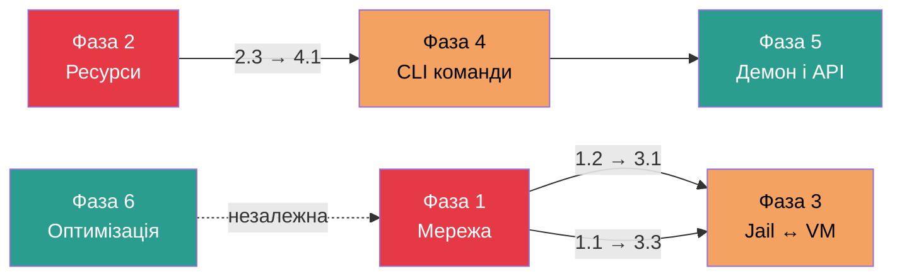
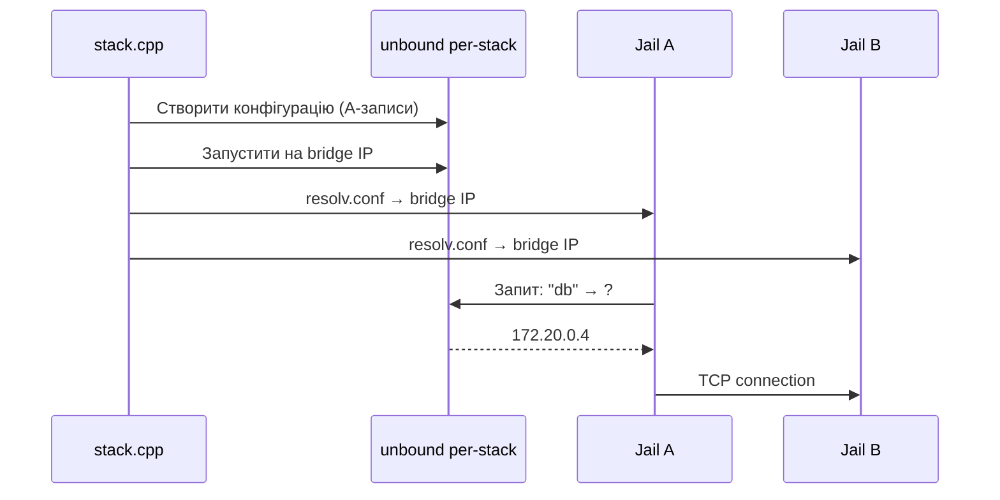
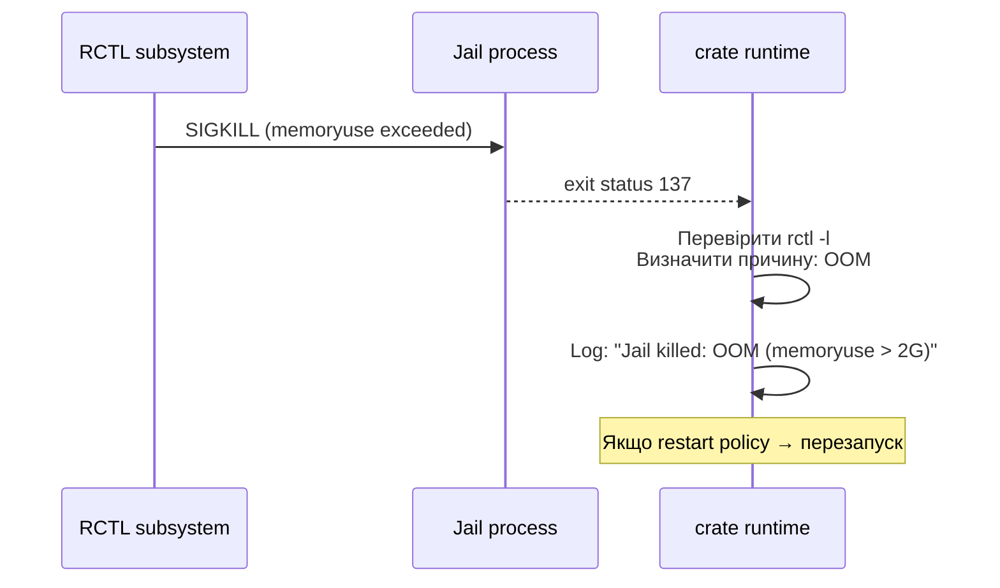
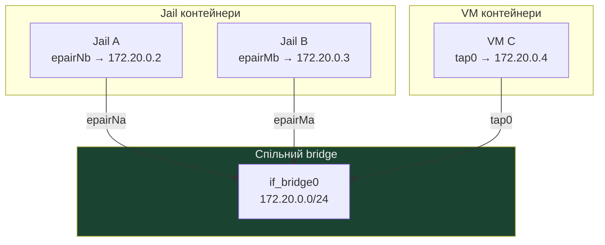
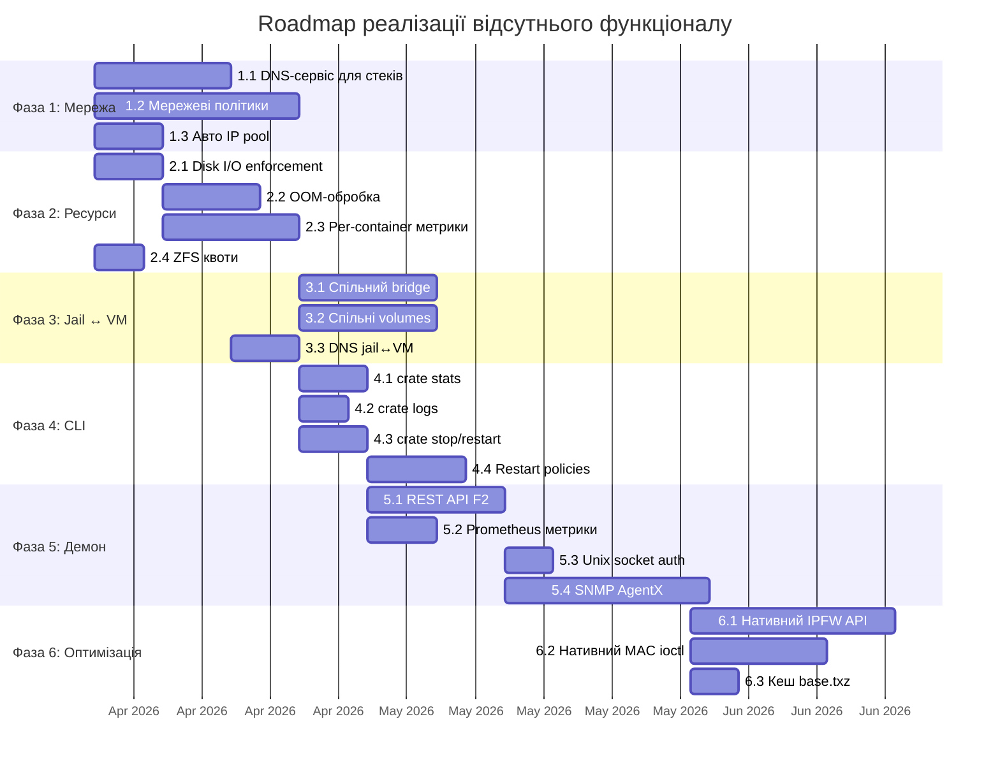

# Багатофазний план реалізації відсутнього функціоналу

## Діаграма залежностей між фазами



---

## Фаза 1: Мережа — базові покращення

**Пріоритет: високий** | **Залежності: немає** | **Складність: середня**

### 1.1 Вбудований DNS-сервіс для стеків

**Проблема:** Зараз контейнери в stack знаходять один одного тільки через інжекцію `/etc/hosts`. Це статично, не підтримує service discovery і ламається при зміні IP.

**Рішення:** Запускати per-stack unbound інстанс на bridge-інтерфейсі, який резолвить імена контейнерів у їхні IP-адреси.

**Файли:**
- `lib/stack.cpp` — додати створення unbound конфігурації per-stack
- `lib/run_services.cpp` — запуск/зупинка unbound інстансу
- `lib/spec.h` — додати `dns_server` опцію в `StackNetwork`

**Реалізація:**
```
StackNetwork {
  name: "app-net"
  bridge: "bridge0"
  subnet: "172.20.0.0/24"
  dns: true              ← НОВЕ
}
```

- Генерувати `unbound.conf` з A-записами для кожного контейнера в стеку
- Прописувати IP unbound як `nameserver` в resolv.conf контейнерів
- Оновлювати зони при додаванні/видаленні контейнерів



---

### 1.2 Мережеві політики між контейнерами

**Проблема:** Всі контейнери на одному bridge бачать один одного без обмежень. Немає можливості заборонити web-контейнеру доступ до db-контейнера напряму.

**Рішення:** Додати секцію `network_policy` в spec з правилами allow/deny між контейнерами.

**Файли:**
- `lib/spec.h` — нова структура `NetworkPolicy`
- `lib/run_net.cpp` — генерація ipfw/pf правил для container↔container трафіку
- `lib/stack.cpp` — застосування політик при запуску стеку

**Реалізація:**
```yaml
network_policy:
  default: deny
  rules:
    - from: web
      to: app
      ports: [8080]
      action: allow
    - from: app
      to: db
      ports: [5432]
      action: allow
```

- Трансляція в ipfw правила на bridge-інтерфейсі
- Використання `FwSlots` для динамічного розподілу слотів правил
- Default deny з explicit allow для дозволених з'єднань

---

### 1.3 Автоматичне призначення IP з пулу

**Проблема:** В stack контейнери не отримують IP автоматично з subnet-діапазону мережі. IP потрібно вказувати вручну або покладатися на DHCP.

**Рішення:** IP pool allocator в stack.cpp, який послідовно видає адреси з subnet.

**Файли:**
- `lib/stack.cpp` — IP pool allocator (виділення з CIDR)

**Реалізація:**
- Парсити subnet CIDR (наприклад `172.20.0.0/24`)
- Резервувати .1 для gateway/bridge
- Видавати .2, .3, ... контейнерам в порядку запуску
- Зберігати mapping у StackDef для DNS і /etc/hosts

---

## Фаза 2: Ресурси — диск і пам'ять

**Пріоритет: високий** | **Залежності: немає** | **Складність: середня-висока**

### 2.1 Верифікація і enforcement disk I/O лімітів

**Проблема:** `readbps`/`writebps` визначені в spec і передаються в RCTL, але немає перевірки що вони дійсно застосовані. FreeBSD RCTL I/O лімітація може вимагати специфічної конфігурації ядра.

**Рішення:** Додати верифікацію після застосування RCTL правил та логування при невдачі.

**Файли:**
- `lib/run_jail.cpp` — перевірка `rctl -l` після `rctl -a`
- `lib/spec.cpp` — валідація що I/O ліміти мають правильний формат (числове значення + суфікс)

**Реалізація:**
```cpp
// Після rctl -a jail:NAME:readbps:deny=50M
// Перевірити: rctl -l jail:NAME → має містити readbps правило
// Якщо відсутнє → warning в лог: "I/O limit not enforced, check kern.racct.enable=1"
```

---

### 2.2 OOM-обробка

**Проблема:** При вичерпанні пам'яті контейнер отримує SIGKILL від RCTL, але crate цього не відстежує. Немає діагностики причини смерті контейнера.

**Рішення:** Моніторити RCTL devd events або перехоплювати SIGKILL/статус виходу процесу.

**Файли:**
- `lib/run_jail.cpp` — trap RCTL signal
- `lib/run.cpp` — обробка exit status, логування причини

**Реалізація:**


---

### 2.3 Per-container RCTL метрики в демоні

**Проблема:** `daemon/metrics.cpp:60` містить TODO — per-container CPU/memory/network метрики не збираються.

**Рішення:** Ітерувати запущені jail'и і запитувати RCTL usage.

**Файли:**
- `daemon/metrics.cpp` — реалізація `collectPerContainerMetrics()`

**Реалізація:**
```cpp
// Для кожного jail:
//   rctl -u jail:NAME → отримати поточне споживання
//   Виставити Prometheus gauge:
//     crate_container_memory_bytes{name="web"} 1073741824
//     crate_container_cpu_percent{name="web"} 23.5
//     crate_container_io_read_bytes{name="web"} 50000000
```

---

### 2.4 ZFS квоти per-container

**Проблема:** Немає обмеження на розмір даних контейнера на рівні ZFS dataset.

**Рішення:** Додати `disk_quota` в spec і застосовувати як ZFS `refquota`.

**Файли:**
- `lib/spec.h` — додати `diskQuota` поле
- `lib/zfs_ops.cpp` — додати `setRefquota(dataset, size)`
- `lib/run.cpp` — застосувати квоту при створенні jail

**Реалізація:**
```yaml
limits:
  disk_quota: 10G    ← НОВЕ
```
```cpp
// zfs set refquota=10G pool/crate/containers/NAME
```

---

## Фаза 3: Кросс-типова взаємодія Jail ↔ VM

**Пріоритет: середній** | **Залежності: Фаза 1.1, 1.2** | **Складність: висока**

### 3.1 Спільний bridge між jail і VM

**Проблема:** Jail використовує epair, VM використовує tap — вони ніколи не з'єднуються. Контейнери різних типів повністю ізольовані.

**Рішення:** Підключати VM tap-інтерфейс до того ж if_bridge, що й jail epair.

**Файли:**
- `lib/run_net.cpp` — функція для підключення tap до існуючого bridge
- `lib/vm_run.cpp` — використовувати спільний bridge замість ізольованого tap
- `lib/stack.cpp` — підтримка VM entries в stack

**Реалізація:**


---

### 3.2 Спільні named volumes (jail ↔ VM)

**Проблема:** Jail використовує nullfs для монтування volumes, VM не має доступу до host файлової системи.

**Рішення:** Для VM використовувати virtio-9p (plan9 filesystem) або NFS для доступу до тих самих hostPath.

**Файли:**
- `lib/vm_run.cpp` — додати virtio-9p share до bhyve конфігурації
- `lib/vm_spec.h` — додати volume mount опції
- `lib/stack.cpp` — уніфікована обробка volumes для jail і VM

**Реалізація:**
```
Jail:  nullfs mount /host/data → /mnt/data (read-only)
VM:    bhyve -s X,virtio-9p,sharename=/host/data → mount_9p в гості
```

---

### 3.3 DNS між jail і VM

**Проблема:** Навіть якщо jail і VM на одному bridge, немає DNS-резолвінгу імен.

**Рішення:** Розширити unbound з Фази 1.1 для включення VM-контейнерів.

**Залежності:** Фаза 1.1

---

## Фаза 4: Операційні команди

**Пріоритет: середній** | **Залежності: Фаза 2.3** | **Складність: низька-середня**

### 4.1 `crate stats TARGET`

**Реалізація:**
```
$ crate stats myapp
NAME    CPU%   MEM      MEM%   NET I/O       DISK I/O      PIDS
myapp   12.3%  256M/2G  12.8%  1.2M/3.4M     50M/120M      23/100
```

**Файли:**
- `cli/main.cpp` — додати підкоманду `stats`
- `lib/commands.h/.cpp` — `statsCrate()` функція
- Використовує: `rctl -u jail:NAME` для отримання usage

---

### 4.2 `crate logs TARGET`

**Реалізація:**
```
$ crate logs myapp
$ crate logs myapp --follow
$ crate logs myapp --tail 100
```

**Файли:**
- `cli/main.cpp` — додати підкоманду `logs`
- `lib/commands.h/.cpp` — `logsCrate()` функція
- Джерело: `/var/log/crate/NAME/` (stdout/stderr контейнера)

---

### 4.3 `crate stop/restart TARGET`

**Реалізація:**
```
$ crate stop myapp          # SIGTERM → wait → SIGKILL
$ crate stop myapp -t 30    # таймаут 30с
$ crate restart myapp       # stop + run
```

**Файли:**
- `cli/main.cpp` — підкоманди `stop`, `restart`
- `lib/commands.h/.cpp` — `stopCrate()`, `restartCrate()`

---

### 4.4 Restart policies

**Реалізація:**
```yaml
restart: on-failure    # або: always, no (default)
restart_max: 5         # макс. кількість перезапусків
restart_delay: 5s      # затримка між перезапусками
```

**Файли:**
- `lib/spec.h` — додати `RestartPolicy` структуру
- `lib/spec.cpp` — парсинг YAML
- `lib/run.cpp` — цикл перезапуску при exit != 0

---

## Фаза 5: Демон і API

**Пріоритет: низький** | **Залежності: Фаза 4** | **Складність: середня**

### 5.1 REST API F2 ендпоінти

**Поточний стан:** Тільки read-only ендпоінти (GET).

**Додати:**
```
POST   /api/v1/containers              → createCrate()
DELETE /api/v1/containers/:name         → destroyCrate()
POST   /api/v1/containers/:name/start  → runCrate()
POST   /api/v1/containers/:name/stop   → stopCrate()
GET    /api/v1/containers/:name/stats  → statsCrate()
GET    /api/v1/containers/:name/logs   → logsCrate()
```

**Файли:** `daemon/routes.cpp`

---

### 5.2 Per-container метрики (Prometheus)

Розширити `/metrics` ендпоінт метриками з Фази 2.3.

**Файли:** `daemon/metrics.cpp`

---

### 5.3 Unix socket автентифікація

**Рішення:** Використовувати `getpeereid()` (FreeBSD) або `LOCAL_PEERCRED` setsockopt для визначення UID з'єднання через Unix socket.

**Файли:** `daemon/auth.cpp`

---

### 5.4 SNMP AgentX

Реалізувати справжній AgentX протокол замість stub'ів у `snmpd/mib.cpp`.

**Файли:** `snmpd/mib.cpp`

---

## Фаза 6: Нативні API і оптимізація

**Пріоритет: низький** | **Залежності: немає** | **Складність: висока**

### 6.1 Нативний IPFW API

Замінити shell-виклики `ipfw(8)` на прямі `setsockopt(IP_FW3)` виклики.

**Файли:** `lib/ipfw_ops.cpp`

**Переваги:** Швидкість, атомарність, менший overhead.

---

### 6.2 Нативний MAC ioctl

Замінити shell-виклики `ugidfw(8)` на `ioctl(/dev/ugidfw)`.

**Файли:** `lib/mac_ops.cpp`

---

### 6.3 Кешування base.txz

Зберігати завантажений `base.txz` у `/var/cache/crate/` з перевіркою SHA-256.

**Файли:** `lib/create.cpp` (або відповідний файл створення контейнерів)

---

## Загальна діаграма залежностей задач



---

## Зведена таблиця

| # | Задача | Пріоритет | Складність | Залежності | Файли |
|---|--------|-----------|------------|------------|-------|
| 1.1 | DNS-сервіс для стеків | Високий | Середня | — | `stack.cpp`, `run_services.cpp`, `spec.h` |
| 1.2 | Мережеві політики | Високий | Середня | — | `spec.h`, `run_net.cpp`, `stack.cpp` |
| 1.3 | Авто IP pool | Високий | Низька | — | `stack.cpp` |
| 2.1 | Disk I/O enforcement | Високий | Низька | — | `run_jail.cpp`, `spec.cpp` |
| 2.2 | OOM-обробка | Високий | Середня | — | `run_jail.cpp`, `run.cpp` |
| 2.3 | Per-container метрики | Високий | Середня | — | `daemon/metrics.cpp` |
| 2.4 | ZFS квоти | Високий | Низька | — | `zfs_ops.cpp`, `spec.h` |
| 3.1 | Jail↔VM bridge | Середній | Висока | 1.2 | `run_net.cpp`, `vm_run.cpp`, `stack.cpp` |
| 3.2 | Jail↔VM volumes | Середній | Висока | — | `vm_run.cpp`, `stack.cpp` |
| 3.3 | Jail↔VM DNS | Середній | Низька | 1.1 | — (розширення 1.1) |
| 4.1 | `crate stats` | Середній | Низька | 2.3 | `cli/main.cpp`, `commands.h/.cpp` |
| 4.2 | `crate logs` | Середній | Низька | — | `cli/main.cpp`, `commands.h/.cpp` |
| 4.3 | `crate stop/restart` | Середній | Низька | — | `cli/main.cpp`, `commands.h/.cpp` |
| 4.4 | Restart policies | Середній | Середня | 4.3 | `spec.h`, `run.cpp` |
| 5.1 | REST API F2 | Низький | Середня | 4.3 | `daemon/routes.cpp` |
| 5.2 | Prometheus метрики | Низький | Низька | 4.1 | `daemon/metrics.cpp` |
| 5.3 | Unix socket auth | Низький | Низька | 5.1 | `daemon/auth.cpp` |
| 5.4 | SNMP AgentX | Низький | Висока | 5.1 | `snmpd/mib.cpp` |
| 6.1 | Нативний IPFW API | Низький | Висока | — | `ipfw_ops.cpp` |
| 6.2 | Нативний MAC ioctl | Низький | Середня | — | `mac_ops.cpp` |
| 6.3 | Кеш base.txz | Низький | Низька | — | `create.cpp` |
